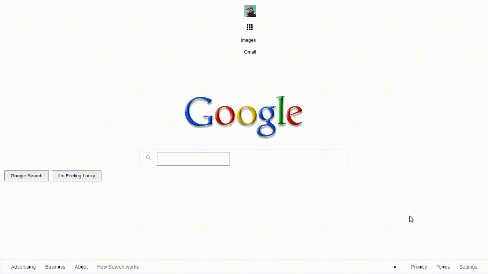

# [Patika.dev](https://patika.dev) css çalışmaları

## Ödev 1
Yapılması istenen:

Benim yaptığım:

https://user-images.githubusercontent.com/96540940/152675398-ea25f0fc-c9b1-4c00-99ba-1caf18d3d733.mp4

Faydalandığım Kaynaklar:
---
[w3schools](https://www.w3schools.com/)

[html reference](https://htmlreference.io/)

## Ödev 2
Yapılması İstenen:

Benim Yaptığım:

## Ödev 3

Yapılması İstenen aşağıdaki şekilde verilen siteyi:

Şu hale getirmekti:

Sesli arama butonu haricini tamamladım ve sonuç bu şekilde:

